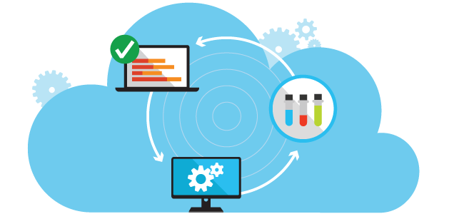

<center> </center>


# BWiOSPackage

iOS Continuous Integration

## Contents

- iOS Xcode Project
- Xcode打包
- 脚本打包
- iOS ipa包
- 持续化集成
- Reference
- 经验总结
- Follow Me

## iOS Xcode Project
- Workspace  

  简单来说，Workspace就是一个容器，在该容器中可以存放多个你创建的Xcode Project， 以及其他的项目中需要使用到的文件。使用Workspace的好处有，1),扩展项目的可视域，即可以在多个项目之间跳转，重构，一个项目可以使用另一个项目的输出。Workspace会负责各个Project之间提供各种相互依赖的关系;2),多个项目之间共享Build目录。

- Project  

  指一个项目，该项目会负责管理生成一个或者多个软件产品的全部文件和配置，一个Project可以包含多个Target。

- Target  

  一个Target是指在一个Project中构建的一个产品，它包含了构建该产品的所有文件，以及如何构建该产品的配置。

- Scheme  

  一个定义好构建过程的Target成为一个Scheme。可在Scheme中定义的Target的构建过程有：Build/Run/Test/Profile/Analyze/Archive

- Build Setting  

  配置产品的Build设置，比方说，使用哪个Architectures？使用哪个版本的SDK？。在Xcode Project中，有Project级别的Build Setting，也有Target级别的Build Setting。Build一个产品时一定是针对某个Target的，因此，XCode中总是优先选择Target的Build Setting，如果Target没有配置，则会使用Project的Build Setting。

- Build Phases
  - Target Dependencies
  - Compile Sources（编译资源，可设置Compiler Flags）
  - Link Binary With Libraries
  - Copy Bundle Resources（直接拷贝到包里面的资源）
  - Run Script（运行脚本，运行脚本不用拷贝到Bundle

## Xcode打包
- 打包机制
  - 流程  
    xcodebuild -> Package；

- xcodebuild  
  - 流程细节  
    Check dependencies（检查项目配置，如Code Sign） -> Preprocessor -> Compile -> Link -> Copy Resource、Compile Xib、CompileStoryboard、CompileAssetCatalog -> Generate DSYM File -> ProcessProductPackaging -> Code Signing（需要访问钥匙串信息） -> Validate -> Result；
  - Result  
    .app和.DSYM；
  - Code Signing
    - Code Signing Identity
    - Provisioning Profile
  - Reference：Terminal执行命令，查看输出信息

- Package  

  - 把.app文件放入命名为“Payload”的新建文件夹中，对“Payload”文件夹进行压缩，对压缩生成的文件修改后缀名为.ipa，这样，就能生成有效的ipa包了；

- Xcode可视化打包  

  Select Generic iOS Device -> Xcode Menu Bar - Product -> Archive -> Select Package Type -> Select Provisoning Profile -> Export ipa or Upload to App Store

## 脚本打包

- 脚本打包思路设计
  - 配置参数设计
  - 脚本修改项目配置和项目代码
  - xcodebuild clean和remove上次打包生成的文件
  - xcodebuild
  - Package, Denominate ipa file, Move files
  - Back up DSYM

- 配置参数设计
  - Configuration-Release or Debug
  - 后台环境
  - 包类型
    - App Store
    - InHouse
    - Adhoc
  - Bundle ID
  - App版本号
  - App Display Name

- 脚本修改项目配置和项目代码

- 命令
  - xcodebuild命令
    - 可构建的对象
      - workspace：必须和“-scheme”一起使用，构建该workspace下的一个scheme。
      - project：当根目录下有多个Project的时候，必须使用“-project”指定project，然后会运行
      - target：构建某个Target
      - scheme：和“-workspace”一起使用，指定构建的scheme。
    - 构建行为
      - clean:清除build目录下的文件，build目录和其子目录没有被移除
      - build: 构建
      - test: 测试某个scheme，必须和"-scheme"一起使用
      - archive:打包，必须和“-scheme”一起使用

  - 获取参数

    - $1、$2。。。、$n,n代表参数编号，$0为第一个参数，在此为脚本的路径，$#获取参数个数

      ```
      param1=$1
      param2=$2
      ```

  - 文件操作
    - 查找文件

      - 命令：find

    - 修改文件
      - 修改文件名

        命令：mv（move files）

        ```
        mv file.txt new_file.txt  # 带上文件格式
        mv directory new_directory  # 修改目录名
        ```

      - 查找和修改文件内容

        命令：sed（stream editor）

        ```
        替换指定文本
          sed -i ".tmp" "/words_to_find_which_line/s/replaced_word/new_word/" file_path
          参数说明
            -i：备份原文件，修改文件的操作不可逆，如果需要查看原来的内容，则可以在备份文件中进行查看，此脚本执行之后会生成一个.tmp文件，谨慎进行移除
            .tmp：备份的原文件名称
            words_to_find_which_line：通过文本找到需要修改的目标文本属于哪一行
            s：替换操作
            replaced_word：被替换的文本
            new_word：新文本
        替换目标位置文本
          sed -i ".tmp" "/words_to_find_which_line/s/regular_expression/new_word/" file_path
          示例
            sed -i ".tmp" "/kEnvironment/s/=.*;/= new_tag;/" file_path  # 更换kEnvironment的值，不修改其余部分，如后面对代码的注释
            说明
              .*：正则表达式规则，“.”表示任意字符，“*”表示任意长度
        ```

    - 移除文件

      命令：rm（remove）

      ```
      rm path/file.format  # 移除文件
      rm -r path/directory  # 移除目录，-r命令可以删除非空目录
      ```

    - 移动文件：mv（move files）

      ```
      mv file_path/file.format new_file_path/new_file.format
      ```

- Reference

  - 终端查看对应的Manuel手册

- 待完善

  - 脚本读取和修改Xcode工程文件信息，如版本号、包类型、授权文件等；
  - 脚本中的参数编写需要设计得更加灵活；

- 学习方向

  - 正则表达式
  - Shell Script
  - 操作文本能力的提高

## iOS ipa包
- ipa包的解压

  修改后缀名，把后缀名修改为Mac OS可解压的，如：ipa -> zip；

- .app包转换为有效的.ipa包

  > 方式一：把.app文件拖入iTunes“我的应用”，再从iTunes中拖出来，就是一个.ipa文件啦；

  > 方式二：把.app文件放入命名为“Payload”的新建文件夹中，对“Payload”文件夹进行压缩，对压缩生成的文件修改后缀名为.ipa；

- 从优秀App的ipa包中提炼信息

  > 如微信等知名应用的ipa包；

## 持续化集成

- 自动化构建

自动化构建的的首要前提  

Anyone should be able to bring in a virgin machine, check the sources 
out of the repository, issue a single command, and have a running 
system on their machine.
自动化构建的的首要前提是有一个支持自动化构建的命令行工具，可以让开发人员可以通过一个简单的命令运行当前项目。

- 命令行工具

自动化构建的命令行工具比持续集成的概念要诞生得早很多，几十年前，Unix世界就已经有了Make，而Java世界有Ant，Maven，以及当前最流行的Gradle，.Net世界则有Nant和MSBuild。作为以GUI和命令行操作结合的完美性著称的苹果公司来说，当然也不会忘记为自己的封闭的iOS系统提供开发环境下命令行编译工具：xcodebuild

- 持续化集成平台
  - Jenkins

## Reference

构建iOS持续集成平台（一）——自动化构建和依赖管理：http://www.infoq.com/cn/articles/build-ios-continuous-integration-platform-part1/

xcodebuild manual

## 经验总结

- Mac OS Terminal中的Shell脚本命令操作后不可以撤销
- Xcode Command+B是按照当前设定的Scheme进行Build，而不是固定选择Release进行Build

## Follow Me

Github:https://github.com/BobWongs